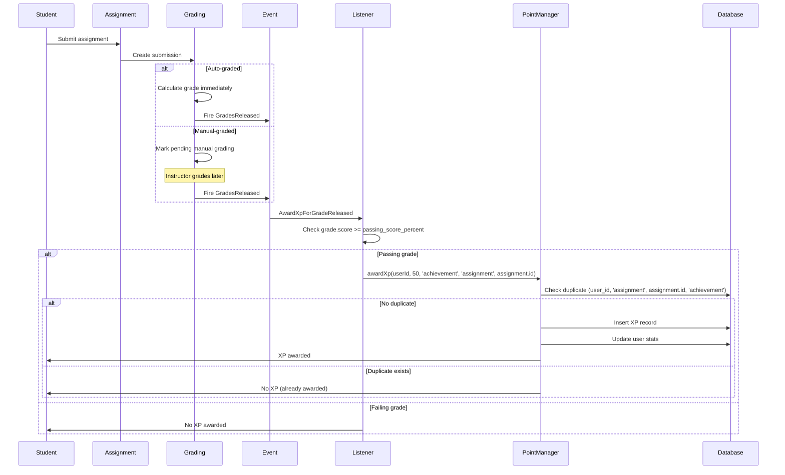
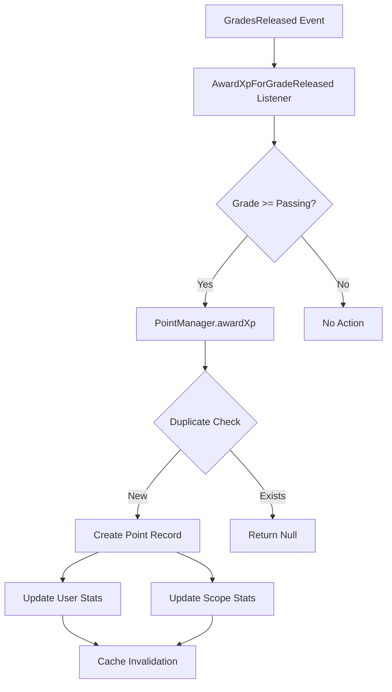
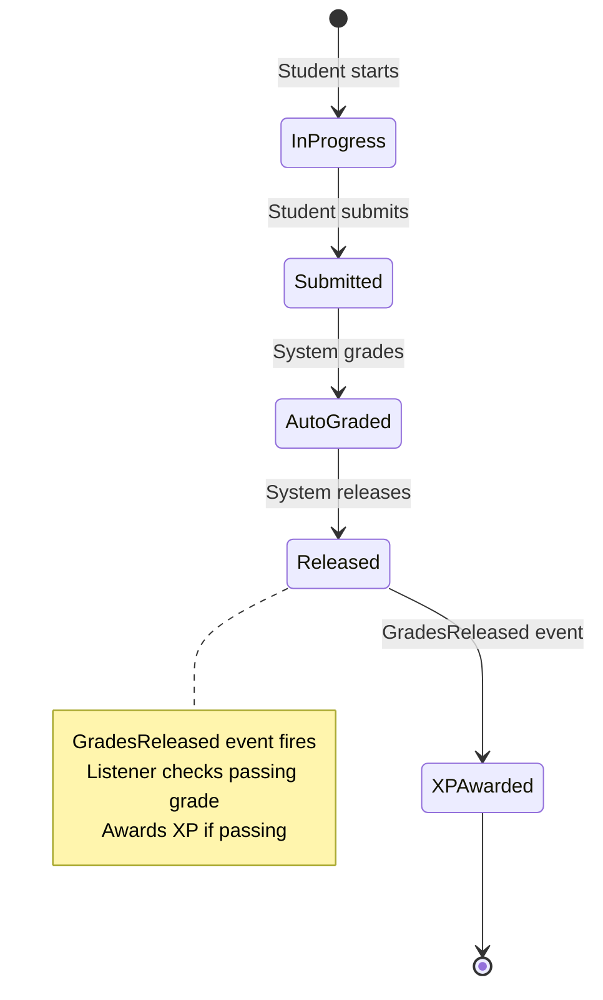
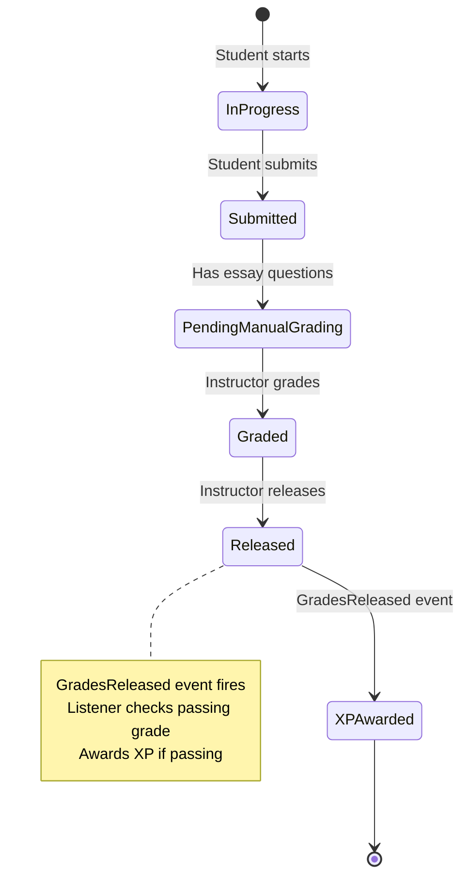
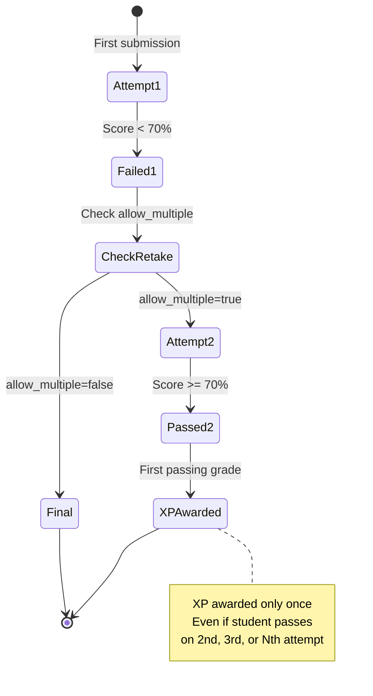

# Design Document: Assignment XP Award System

## Overview

This design implements a correct, one-time XP award system for assignments and quizzes in the Learning Management System. The system awards a flat 50 XP to students who achieve passing grades (≥70% by default) on assignments, with strict duplicate prevention to ensure fairness.

The design modifies the existing gamification system to:
- Award XP only when grades are released (not on submission)
- Use assignment.id as the unique source identifier (not grade.id or submission.id)
- Award flat 50 XP for all passing grades (removing tiered XP)
- Support both auto-graded (immediate) and manual-graded (deferred) workflows
- Add allow_multiple field to control retake permissions

The implementation leverages existing infrastructure:
- GradesReleased event for triggering XP awards
- PointManager.awardXp() with built-in duplicate prevention
- Database unique constraint on (user_id, source_type, source_id, reason)
- GamificationRepository.pointExists() for duplicate checking

## Architecture

### High-Level Flow



### Component Architecture



## Components and Interfaces

### 1. AwardXpForGradeReleased Listener (Complete Rewrite)

**Location:** `Modules/Gamification/app/Listeners/AwardXpForGradeReleased.php`

**Responsibilities:**
- Listen to GradesReleased event
- Validate grade meets passing threshold
- Award flat 50 XP using assignment.id as source
- Handle multiple submissions in single event

**Interface:**
```php
class AwardXpForGradeReleased
{
    public function __construct(
        private readonly GamificationService $gamification
    ) {}

    public function handle(GradesReleased $event): void
    {
        // For each submission in event
        // - Extract grade and assignment
        // - Check if grade is released
        // - Get passing threshold from settings
        // - Compare grade.effective_score >= passing_score_percent
        // - If passing: award XP with correct source tracking
    }
}
```

**Key Changes from Current Implementation:**
- Remove tiered XP calculation (calculateXpFromScore method)
- Use assignment.id instead of grade.id as source_id
- Use 'assignment' instead of 'grade' as source_type
- Use flat XP amount from 'gamification.points.assignment_completion' setting
- Add passing grade threshold check

### 2. Assignment Model Enhancement

**Location:** `Modules/Learning/app/Models/Assignment.php`

**Changes:**
- Add `allow_multiple` boolean field to $fillable
- Add `allow_multiple` to $casts as 'boolean'
- Default value handled by migration

**Interface Addition:**
```php
protected $fillable = [
    // ... existing fields ...
    'allow_multiple',
];

protected $casts = [
    // ... existing casts ...
    'allow_multiple' => 'boolean',
];
```

### 3. PointManager (No Changes Required)

**Location:** `Modules/Gamification/app/Services/Support/PointManager.php`

**Existing Functionality Used:**
- `awardXp()` method with duplicate prevention
- Accepts `allow_multiple` option (defaults to true)
- Calls `pointExists()` when allow_multiple=false
- Handles race conditions via unique constraint exception
- Updates user stats and scope stats automatically

**Usage Pattern:**
```php
$this->gamification->awardXp(
    $userId,
    $xpAmount,
    'achievement',
    'assignment',
    $assignmentId,
    [
        'description' => 'Assignment completion XP',
        'allow_multiple' => false,
    ]
);
```

### 4. GamificationRepository (No Changes Required)

**Location:** `Modules/Gamification/app/Repositories/GamificationRepository.php`

**Existing Functionality Used:**
- `pointExists()` method for duplicate checking
- `createPoint()` method for XP record creation

### 5. Remove AwardXpForAssignmentSubmission Listener

**Location:** `Modules/Gamification/app/Listeners/AwardXpForAssignmentSubmission.php`

**Action:** Delete this file entirely

**EventServiceProvider Update:**
Remove listener registration from event mappings

## Data Models

### Points Table (Existing)

```sql
CREATE TABLE points (
    id BIGSERIAL PRIMARY KEY,
    user_id BIGINT NOT NULL,
    points INTEGER NOT NULL,
    reason VARCHAR(255) NOT NULL,
    source_type VARCHAR(255),
    source_id BIGINT,
    description TEXT,
    created_at TIMESTAMP,
    updated_at TIMESTAMP,
    UNIQUE (user_id, source_type, source_id, reason)
);
```

**Key Fields for Assignment XP:**
- `user_id`: Student receiving XP
- `points`: Always 50 for assignment completion
- `reason`: Always 'achievement'
- `source_type`: Always 'assignment'
- `source_id`: Assignment primary key (assignment.id)
- `description`: Human-readable description

**Unique Constraint:** Prevents duplicate XP for same (user, assignment, reason)

### Assignments Table (Modified)

**Migration Required:** Add allow_multiple column

```sql
ALTER TABLE assignments 
ADD COLUMN allow_multiple BOOLEAN NOT NULL DEFAULT TRUE;
```

**Migration File:** `{timestamp}_add_allow_multiple_to_assignments_table.php`

```php
public function up(): void
{
    Schema::table('assignments', function (Blueprint $table) {
        $table->boolean('allow_multiple')->default(true);
    });
}

public function down(): void
{
    Schema::table('assignments', function (Blueprint $table) {
        $table->dropColumn('allow_multiple');
    });
}
```

### System Settings (Configuration)

**Required Settings:**

1. **Passing Score Threshold:**
   - Key: `grading.passing_score_percent`
   - Type: Integer
   - Default: 70
   - Description: Minimum score percentage to pass and earn XP

2. **Assignment Completion XP:**
   - Key: `gamification.points.assignment_completion`
   - Type: Integer
   - Default: 50
   - Description: Flat XP amount for completing any assignment with passing grade

**Deprecated Settings (Remove):**
- `gamification.points.grade.tier_s` (90+ score)
- `gamification.points.grade.tier_a` (80-89 score)
- `gamification.points.grade.tier_b` (70-79 score)
- `gamification.points.grade.tier_c` (60-69 score)
- `gamification.points.grade.min` (below 60 score)

## Event Flow

### Auto-Graded Assignment Flow



### Manual-Graded Assignment Flow



### Failed Assignment with Retake Flow



## Correctness Properties

*A property is a characteristic or behavior that should hold true across all valid executions of a system—essentially, a formal statement about what the system should do. Properties serve as the bridge between human-readable specifications and machine-verifiable correctness guarantees.*

### Property 1: One-Time XP Award Per Assignment

*For any* user and assignment, if XP has been awarded once for that assignment, then attempting to award XP again for the same assignment should be rejected, regardless of how many times the student submits or passes the assignment.

**Validates: Requirements 1.1, 1.2, 10.2**

### Property 2: Correct Source Tracking

*For any* XP transaction created for assignment completion, the transaction should have source_type='assignment', source_id equal to the assignment's primary key, and reason='achievement'.

**Validates: Requirements 1.3, 1.4, 8.1, 8.2, 8.3, 8.4, 10.4**

### Property 3: Passing Grade Requirement

*For any* grade, XP should be awarded if and only if the grade's effective_score is greater than or equal to the passing_score_percent threshold (default 70%).

**Validates: Requirements 2.2, 2.3, 2.4, 5.3, 10.3**

### Property 4: Flat XP Amount

*For any* passing grade on any assignment, the XP amount awarded should be exactly 50 points, regardless of the actual score achieved (70%, 85%, 100% all receive 50 XP).

**Validates: Requirements 3.1, 3.2, 3.4, 10.5**

### Property 5: XP Awarded on GradesReleased Event

*For any* GradesReleased event containing a submission with a passing grade, XP should be awarded to the student at the time the event is handled.

**Validates: Requirements 4.2, 5.2**

### Property 6: No Participation XP on Submission

*For any* assignment submission, creating the submission should not create any XP transaction records.

**Validates: Requirements 6.1, 6.2**

### Property 7: Default allow_multiple Value

*For any* newly created assignment where allow_multiple is not explicitly specified, the allow_multiple field should default to true.

**Validates: Requirements 7.2, 9.3**

### Property 8: No XP Cap

*For any* sequence of passing grades across multiple assignments in one or more courses, XP should continue to be awarded for each unique assignment without any maximum limit at the course or global level.

**Validates: Requirements 11.1, 11.2, 11.4**

## Error Handling

### Duplicate XP Prevention

**Scenario:** Race condition where multiple processes try to award XP for same assignment

**Handling:**
1. Database unique constraint catches duplicate at DB level
2. PointManager catches UniqueConstraintViolationException
3. Returns null (no error thrown)
4. Idempotent behavior: safe to call multiple times

**Code Pattern:**
```php
try {
    $point = $this->repository->createPoint([...]);
    // Update stats
    return $point;
} catch (\Illuminate\Database\UniqueConstraintViolationException $e) {
    return null; // Already awarded
}
```

### Missing Configuration

**Scenario:** System settings not found

**Handling:**
- Use default values via SystemSetting::get() second parameter
- `grading.passing_score_percent` defaults to 70
- `gamification.points.assignment_completion` defaults to 50
- No exceptions thrown, system continues with sensible defaults

### Invalid Grade Data

**Scenario:** Grade object missing or not released

**Handling:**
- Check `$grade` is not null before processing
- Check `$grade->isReleased()` returns true
- Skip submission if checks fail (continue to next)
- No XP awarded, no error logged (expected condition)

**Code Pattern:**
```php
foreach ($event->submissions as $submission) {
    $grade = $submission->grade;
    
    if (!$grade || !$grade->isReleased()) {
        continue; // Skip this submission
    }
    
    // Process XP award
}
```

### Assignment Not Found

**Scenario:** Assignment deleted but grade still exists

**Handling:**
- PointManager.resolveScopes() handles missing assignment gracefully
- Returns null for course/unit scopes
- XP still awarded (global stats updated)
- Scope stats not updated (acceptable degradation)

### Event Payload Issues

**Scenario:** GradesReleased event with empty submissions collection

**Handling:**
- foreach loop handles empty collection naturally
- No iterations, no XP awarded
- No error thrown (valid edge case)

## Testing Strategy

### Dual Testing Approach

This feature requires both unit tests and property-based tests for comprehensive coverage:

**Unit Tests:** Focus on specific examples, edge cases, and integration points
- Specific grade scores (69.9%, 70%, 100%)
- Missing configuration values
- Null grade objects
- Empty event payloads
- Event listener registration

**Property-Based Tests:** Verify universal properties across all inputs
- Generate random users, assignments, grades, scores
- Run minimum 100 iterations per property
- Cover wide input space automatically
- Catch edge cases not thought of manually

### Property-Based Testing Configuration

**Library:** Use Pest PHP with property testing plugin or implement generators

**Configuration:**
- Minimum 100 iterations per property test
- Each test tagged with feature and property reference
- Tag format: `Feature: assignment-xp-award-system, Property {number}: {property_text}`

**Example Test Structure:**
```php
test('Property 1: One-time XP award per assignment', function () {
    // Generate random user and assignment
    // Award XP first time
    // Attempt to award XP second time
    // Assert second attempt rejected
})->repeat(100);
```

### Unit Test Coverage

**Listener Tests** (`tests/Unit/Listeners/AwardXpForGradeReleasedTest.php`):
- Passing grade awards XP
- Failing grade does not award XP
- Exactly 70% awards XP (boundary)
- 69.9% does not award XP (boundary)
- Missing grade skipped
- Unreleased grade skipped
- Multiple submissions in single event
- Uses correct source_type and source_id
- Uses correct reason
- Uses flat XP amount from settings

**Model Tests** (`tests/Unit/Models/AssignmentTest.php`):
- allow_multiple field exists
- allow_multiple defaults to true
- allow_multiple can be set to false
- allow_multiple is boolean type

**Integration Tests** (`tests/Feature/XpAwardIntegrationTest.php`):
- Auto-graded assignment awards XP immediately
- Manual-graded assignment awards XP after instructor grades
- Second passing attempt does not award duplicate XP
- Submission does not award XP
- XP awarded for multiple assignments in same course
- XP awarded across multiple courses without cap

### Property-Based Test Coverage

**Property Test 1: One-Time XP Award**
```php
test('Property 1: One-time XP award per assignment', function () {
    $user = User::factory()->create();
    $assignment = Assignment::factory()->create();
    
    // Award XP first time
    $result1 = awardXpForAssignment($user->id, $assignment->id, 85.0);
    expect($result1)->not->toBeNull();
    
    // Attempt second time
    $result2 = awardXpForAssignment($user->id, $assignment->id, 95.0);
    expect($result2)->toBeNull();
    
    // Verify only one record exists
    $count = Point::where('user_id', $user->id)
        ->where('source_type', 'assignment')
        ->where('source_id', $assignment->id)
        ->count();
    expect($count)->toBe(1);
})->repeat(100);
// Feature: assignment-xp-award-system, Property 1: One-time XP award per assignment
```

**Property Test 2: Correct Source Tracking**
```php
test('Property 2: Correct source tracking', function () {
    $user = User::factory()->create();
    $assignment = Assignment::factory()->create();
    $score = fake()->numberBetween(70, 100);
    
    awardXpForAssignment($user->id, $assignment->id, $score);
    
    $point = Point::where('user_id', $user->id)->latest()->first();
    expect($point->source_type)->toBe('assignment');
    expect($point->source_id)->toBe($assignment->id);
    expect($point->reason)->toBe('achievement');
})->repeat(100);
// Feature: assignment-xp-award-system, Property 2: Correct source tracking
```

**Property Test 3: Passing Grade Requirement**
```php
test('Property 3: Passing grade requirement', function () {
    $user = User::factory()->create();
    $assignment = Assignment::factory()->create();
    $passingThreshold = 70;
    
    // Generate random score
    $score = fake()->randomFloat(2, 0, 100);
    
    $result = awardXpForAssignment($user->id, $assignment->id, $score);
    
    if ($score >= $passingThreshold) {
        expect($result)->not->toBeNull();
    } else {
        expect($result)->toBeNull();
    }
})->repeat(100);
// Feature: assignment-xp-award-system, Property 3: Passing grade requirement
```

**Property Test 4: Flat XP Amount**
```php
test('Property 4: Flat XP amount', function () {
    $user = User::factory()->create();
    $assignment = Assignment::factory()->create();
    $score = fake()->numberBetween(70, 100); // Any passing score
    
    awardXpForAssignment($user->id, $assignment->id, $score);
    
    $point = Point::where('user_id', $user->id)->latest()->first();
    expect($point->points)->toBe(50);
})->repeat(100);
// Feature: assignment-xp-award-system, Property 4: Flat XP amount
```

**Property Test 5: XP Awarded on GradesReleased Event**
```php
test('Property 5: XP awarded on GradesReleased event', function () {
    $user = User::factory()->create();
    $assignment = Assignment::factory()->create();
    $submission = Submission::factory()->create([
        'user_id' => $user->id,
        'assignment_id' => $assignment->id,
    ]);
    $grade = Grade::factory()->create([
        'user_id' => $user->id,
        'source_type' => 'assignment',
        'source_id' => $assignment->id,
        'effective_score' => fake()->numberBetween(70, 100),
        'status' => 'released',
    ]);
    $submission->grade()->associate($grade);
    
    // Fire event
    event(new GradesReleased(collect([$submission])));
    
    // Verify XP awarded
    $point = Point::where('user_id', $user->id)
        ->where('source_id', $assignment->id)
        ->first();
    expect($point)->not->toBeNull();
})->repeat(100);
// Feature: assignment-xp-award-system, Property 5: XP awarded on GradesReleased event
```

**Property Test 6: No Participation XP on Submission**
```php
test('Property 6: No participation XP on submission', function () {
    $user = User::factory()->create();
    $assignment = Assignment::factory()->create();
    
    // Create submission
    $submission = Submission::factory()->create([
        'user_id' => $user->id,
        'assignment_id' => $assignment->id,
    ]);
    
    // Verify no XP awarded
    $count = Point::where('user_id', $user->id)->count();
    expect($count)->toBe(0);
})->repeat(100);
// Feature: assignment-xp-award-system, Property 6: No participation XP on submission
```

**Property Test 7: Default allow_multiple Value**
```php
test('Property 7: Default allow_multiple value', function () {
    $assignment = Assignment::factory()->create([
        // Explicitly not setting allow_multiple
    ]);
    
    expect($assignment->allow_multiple)->toBeTrue();
})->repeat(100);
// Feature: assignment-xp-award-system, Property 7: Default allow_multiple value
```

**Property Test 8: No XP Cap**
```php
test('Property 8: No XP cap', function () {
    $user = User::factory()->create();
    $course = Course::factory()->create();
    
    // Create random number of assignments (5-20)
    $assignmentCount = fake()->numberBetween(5, 20);
    $assignments = Assignment::factory()->count($assignmentCount)->create([
        'assignable_type' => Course::class,
        'assignable_id' => $course->id,
    ]);
    
    // Award XP for all assignments
    foreach ($assignments as $assignment) {
        awardXpForAssignment($user->id, $assignment->id, 85.0);
    }
    
    // Verify all XP awarded (no cap)
    $totalXp = Point::where('user_id', $user->id)->sum('points');
    expect($totalXp)->toBe($assignmentCount * 50);
})->repeat(100);
// Feature: assignment-xp-award-system, Property 8: No XP cap
```

### Test Execution

**Run all tests:**
```bash
composer test
```

**Run specific test file:**
```bash
vendor/bin/pest tests/Unit/Listeners/AwardXpForGradeReleasedTest.php
```

**Run property-based tests only:**
```bash
vendor/bin/pest --filter="Property"
```

**Code style check:**
```bash
vendor/bin/pint --test
```

**Static analysis:**
```bash
composer phpstan
```

### Test Data Factories

**Required Factories:**
- `AssignmentFactory` - Generate assignments with random attributes
- `SubmissionFactory` - Generate submissions linked to users and assignments
- `GradeFactory` - Generate grades with random scores
- `UserFactory` - Generate test users

**Factory Considerations:**
- Use realistic data ranges (scores 0-100, dates within reasonable bounds)
- Ensure referential integrity (submission.assignment_id exists)
- Support state transitions (submission states, grade release status)
